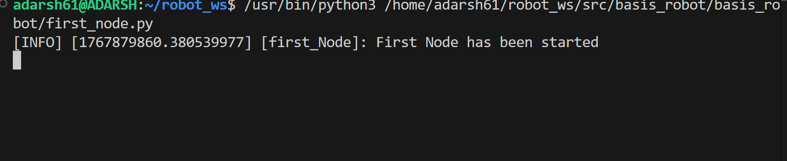

<div align="center">

# 🚀 ROS 2 FUNDAMENTALS – HANDS-ON LEARNING

### A Complete Practical Repository for ROS 2 Core Concepts  
**Nodes • Topics • Services • Parameters • Actions**

<br/>

👨‍💻 **Author:** Adarsh Kumar  
🎯 **Focus:** Deep understanding of ROS 2 fundamentals with clean implementations  
🧠 **Philosophy:** Learn concepts → implement → verify → document  

<br/>
<hr width="60%"/>
<br/>

</div>

<div align="center">

## 📖 OVERVIEW

This repository contains my **hands-on implementation of ROS 2 fundamentals** using  
**Python (`rclpy`)**.

Each concept is implemented with:
- Clear structure  
- Minimal but complete code  
- Real terminal-verified output  

This repository is designed to **prove understanding**, not just usage.

<br/>
</div>

<div align="center">

## 🛠 TECH STACK

- **ROS 2:** Humble Hawksbill  
- **Language:** Python (rclpy)  
- **OS:** Ubuntu 22.04 (WSL)  
- **Build Tool:** colcon  
- **Middleware:** DDS  

<br/>
</div>

<div align="center">

## 📂 PROJECT STRUCTURE

</div>

```text
robot_ws/
├── src/
│   └── basis_robot/
│       ├── basis_robot/
│       │   ├── __init__.py
│       │   ├── first_node.py
│       │   ├── talker.py
│       │   ├── listener.py
│       │   ├── service_server.py
│       │   ├── service_client.py
│       │   ├── service_add_two_int.py
│       │   ├── client_add_two_int.py
│       │   ├── parameter.py
│       │   ├── parameter2.py
│       │   ├── parameter3.py
│       │   ├── parameter4.py
│       │   ├── action_server.py
│       │   ├── action_client.py
│       ├── package.xml
│       ├── setup.py
│       ├── setup.cfg
│       └── DEMO.md
```

<div align="center">
🧠 ROS 2 FUNDAMENTALS
<br/> </div> <div align="center">
1️⃣ ROS 2 NODES
📌 Concept

A Node is the smallest executable unit in ROS 2.
Each node performs a single responsibility.

📄 Files

first_node.py 

▶️ Run
</div>
ros2 run basis_robot first_node

<div align="center">
🖼 OUTPUT
</div>


<div align="center">
2️⃣ TOPICS (Publisher & Subscriber)
📌 Concept

Topics enable continuous data flow between nodes.

📄 Files

talker.py • listener.py

▶️ Run
</div>
ros2 run basis_robot talker
ros2 run basis_robot listener

<div align="center">
🖼 OUTPUT
</div>


<div align="center">
3️⃣ SERVICES (Client & Server)
📌 Concept

Services provide synchronous request–response communication.

📄 Files

service_server.py • service_client.py
service_add_two_int.py • client_add_two_int.py

▶️ Run
</div>
ros2 run basis_robot service_server
ros2 run basis_robot service_client

<div align="center">
🖼 OUTPUT
</div>


<div align="center">
4️⃣ PARAMETERS (Dynamic Configuration)
📌 Concept

Parameters allow runtime configuration of nodes
without restarting them.

📄 Files

parameter.py • parameter2.py • parameter3.py • parameter4.py

▶️ Run
</div>
ros2 run basis_robot parameter4
ros2 param set /myparamnode robot_speed 2.0

<div align="center">
🖼 OUTPUT
</div>


<div align="center">
5️⃣ ACTIONS ⭐ (Goal • Feedback • Result)
📌 Concept

Actions are used for long-running robotic tasks requiring:

Goal handling

Continuous feedback

Final result

📄 Files

action_server.py • action_client.py

▶️ Run
</div>
ros2 run basis_robot actionserver
ros2 run basis_robot actionclient

<div align="center">
🔄 ACTION LIFECYCLE

✔ Goal sent
✔ Goal accepted
✔ Feedback streamed
✔ Result received

🖼 OUTPUT
</div>


<div align="center">
🧪 BUILD & RUN
</div>
colcon build --symlink-install
source install/setup.bash

<div align="center">
🎯 LEARNING OUTCOME

✔ Strong understanding of ROS 2 architecture
✔ Ability to write nodes without copy-paste
✔ Clear grasp of Topics, Services, Parameters & Actions
✔ Debugging of ROS 2 executables & packaging

<br/> </div> <div align="center">
🚀 NEXT STEPS

Launch Files

URDF & TF2

RViz & Gazebo

Navigation Stack

Hardware Integration

<br/> <hr width="60%"/> </div> <div align="center">
📬 CONNECT

GitHub: (https://github.com/Adarshkumar61)
LinkedIn: (https://www.linkedin.com/in/adarsh-kumar-94a859327/)

<br/>

⭐ If this repository helped you learn ROS 2, give it a star!

</div> ```